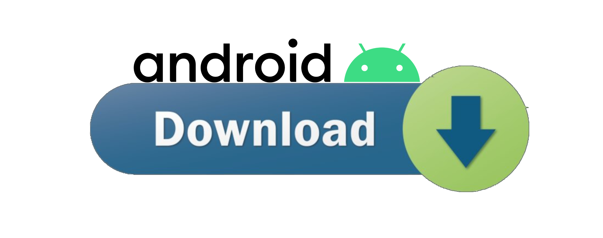
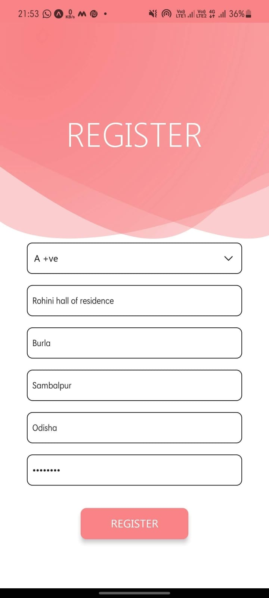
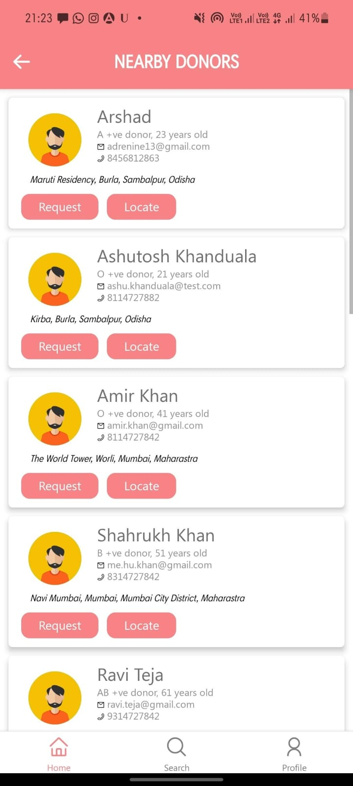
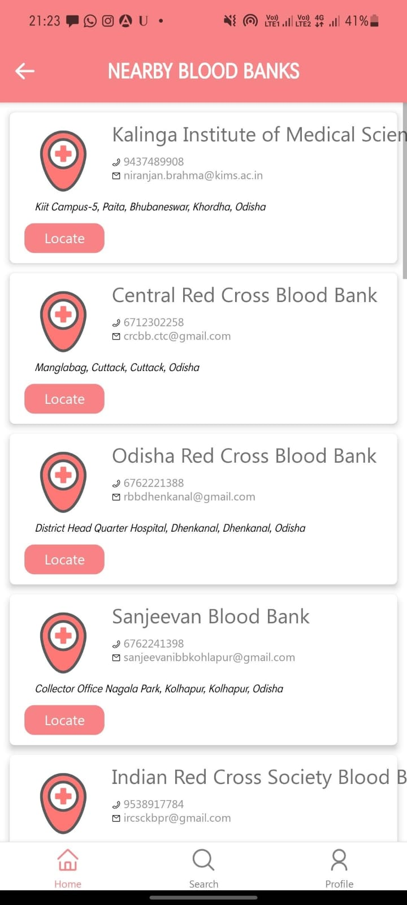
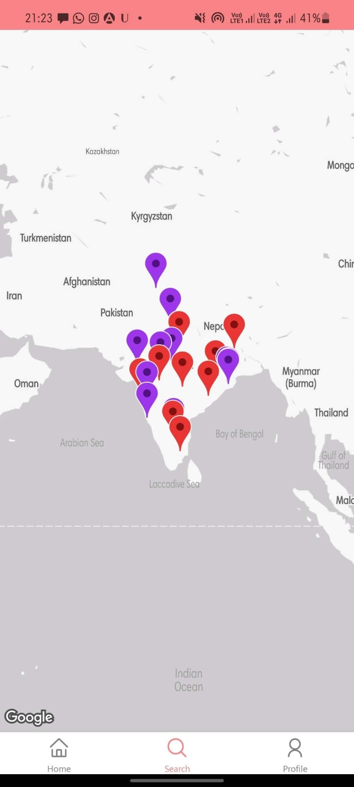

# Find a Donor | Blooad Donor app

An App that helps you find blood donors or blood banks nearby with a simple UI. You can also register as a donor/blood bank
- It uses Azure Maps to find nearby donors/blood banks data. 
- We are rendering all those map data using react-native-maps (uses google maps). 
- For database solution we have used Azure Cosmos DB.

### Downlaod the app from here:
<!-- https://bit.ly/BloodDonorAppDL -->

hazukashidana🙂

 
It's a hackathon project. This app's UI is not that good. But it's functional. I'll not be working on it anymore. If you want to contribute, feel free to do so. I'll be happy to merge your PRs :)

### Screenshots

#### Sign in screen

Register/Login

#### Home Screen

List nearby donors / blood banks

<table>
  <tr>
    <td></td>
    <td></td>
  </tr>
</table>

#### Maps Search

Find nearby donors / blood banks on Azure Maps

